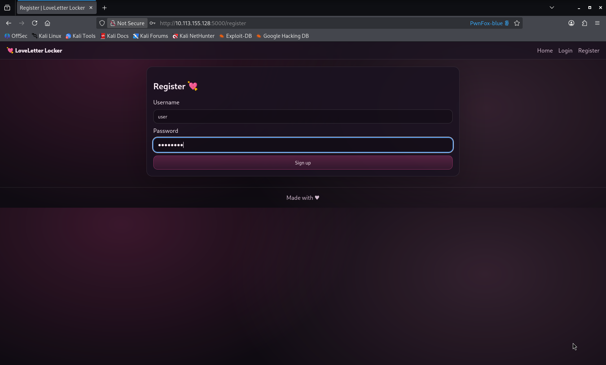
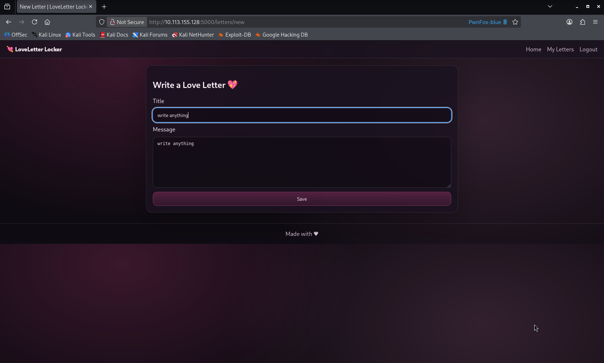
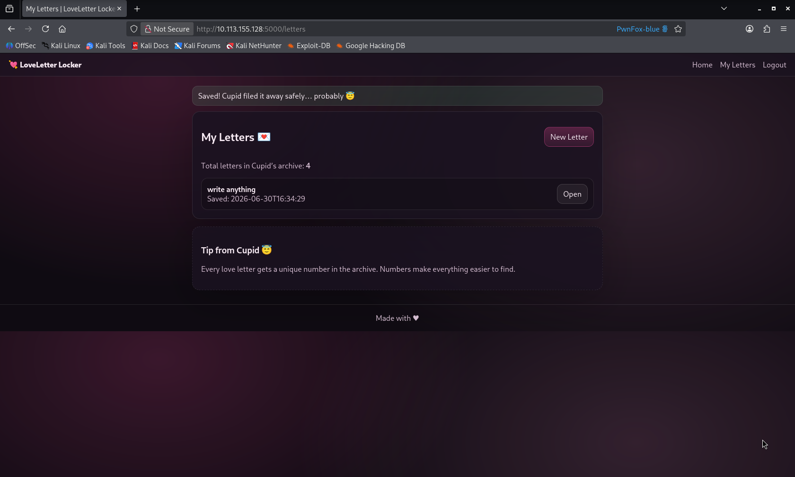
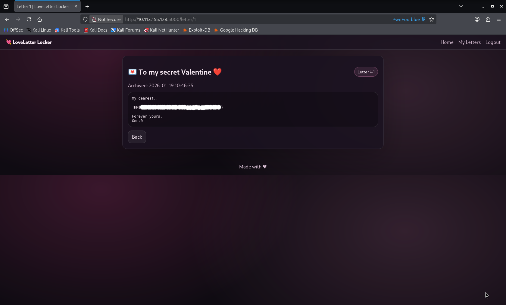

# Horizontal IDOR in Love Letter Locker Allows Unauthorized Access to Other Users' Private Letters


## Summary

A Horizontal IDOR (Insecure Direct Object Reference) vulnerability exists in the Love Letter Locker web application, allowing authenticated users to access private letters belonging to other users by modifying the letter ID parameter in the URL.

The application does not properly verify ownership of the requested letter, allowing users to retrieve unauthorized resources by changing the direct object reference.


## Description

The Love Letter Locker application allows users to create and view their personal letters.

After creating a letter, the application assigns a numeric identifier and uses it directly in the URL endpoint:

```

/letter/{id}

```

However, the application does not perform proper authorization checks to verify whether the requested letter belongs to the authenticated user.

By modifying the letter ID value, an attacker can access letters created by other users.

This results in a Horizontal IDOR vulnerability because a user can access resources belonging to another user with the same privilege level.


## Steps to Reproduce

1. Create a new account on the application.

Example:

```

Username: user1

```

2. Login using the created account.

3. After authentication, access the main page.

4. Create a new letter using the **New Letter** functionality.

Example:

```

Title: Test Letter
Content: This is my private letter

```

5. Return to the main page and open the created letter.

6. Observe the URL endpoint:

```

/letter/4

```

7. Notice that the letter ID is directly exposed in the URL.

8. Modify the letter ID value:

Original:

```

/letter/4

```

Modified:

```

/letter/3

```

9. The application displays another user's letter without requiring additional authorization.

10. The unauthorized letter contains the flag.


## Proof Of Concept (POC)


### 1. Creating a User Account

A normal user account was created and used to authenticate into the application.




---

### 2. Creating a Letter

After logging in, navigate to the letter creation page and create a new letter.


New letter was created using the application functionality.


---

### 3. Identifying the Direct Object Reference

After opening the created letter, the application used the following endpoint:

```

/letter/4

```

The numeric value represents the letter ID.


---

### 4. Testing IDOR by Changing the Letter ID

The letter ID was modified manually:

```

/letter/4

```

Changed to:

```
/letter/3
or
/letter/2
or
/letter/1

```

The application returned a letter that did not belong to the authenticated user.


---

### 5. Retrieving the Flag

The unauthorized letter contained the flag:

```

THM{Try_It_By_YourSelf}

````




---


## Impact

An attacker with a valid account can enumerate letter IDs and access private letters belonging to other users.

This vulnerability can lead to:

- Unauthorized access to private messages.
- Exposure of sensitive user information.


## Recommended Fix

The application should implement proper server-side authorization checks before returning any letter.

Recommended security measures:

- Verify that the requested letter belongs to the authenticated user.
- Do not trust user-controlled identifiers directly from URLs.
- Implement proper access control mechanisms.
- Return an authorization error when a user attempts to access another user's resource.

Example:

```php
if ($letter['user_id'] !== $_SESSION['user_id']) {
    http_response_code(403);
    exit("Forbidden");
}
````
