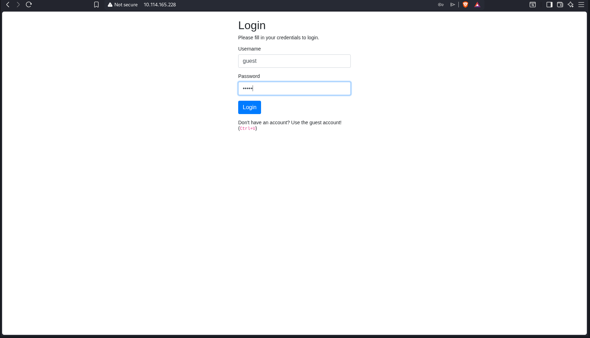
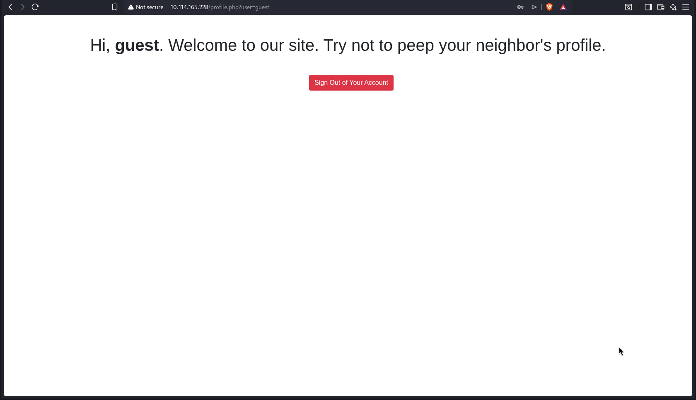
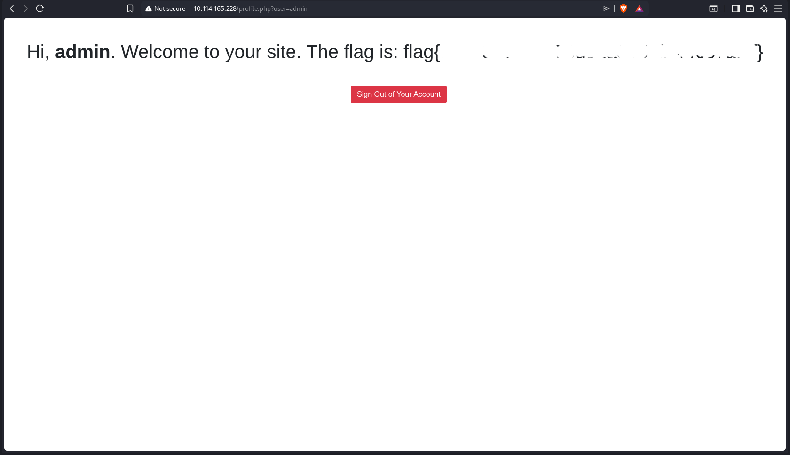

## IDOR Allows Privilege Escalation by Manipulating the user URL Parameter


## Target

TryHackMe Room:
https://tryhackme.com/room/neighbour


## Summary

An Insecure Direct Object Reference (IDOR) vulnerability exists in the `user` query parameter of the `profile.php` endpoint. By changing the parameter value from `guest` to `admin`, an attacker can gain unauthorized administrative access because the application does not properly validate user authorization on the server side. This vulnerability can lead to privilege escalation and unauthorized access to sensitive functionality.


## Description

The application uses the `user` query parameter in the `/profile.php` endpoint to determine the user's role. However, the application fails to enforce proper server-side authorization checks and trusts the user-controlled parameter.

An attacker can simply modify the `user` parameter from `guest` to `admin` to gain administrative privileges. This results in an Insecure Direct Object Reference (IDOR) vulnerability that allows vertical privilege escalation and unauthorized access to administrator-only functionality.

Because authorization is based solely on a user-controlled URL parameter, an attacker can bypass access controls and impersonate an administrator without authentication or permission.


## Steps to Reproduce

1. Log in to the application as a regular user (or access the application as `guest`).
2. Navigate to the profile page:

   ```
   /profile.php?user=guest
   ```
3. Intercept or manually edit the request.
4. Change the value of the `user` parameter from `guest` to `admin`:

   ```
   /profile.php?user=admin
   ```
5. Send the modified request.
6. Observe that the application grants administrative access without performing proper server-side authorization checks, resulting in vertical privilege escalation.


## Proof of Concept (PoC)

1. Log in using the guest account.

   

2. After authentication, the application redirects to:

   ```text
   /profile.php?user=guest
   ```

   The page displays the guest profile.

   

3. Modify the `user` query parameter from `guest` to `admin`:

   ```text
   /profile.php?user=admin
   ```

4. Reload the page.

5. The application grants access to the administrator's profile and reveals the administrator-only flag without performing any server-side authorization checks.

   


## Impact

An attacker can gain unauthorized administrative access by modifying the `user` query parameter. This results in vertical privilege escalation, allowing access to administrator-only resources, sensitive information, and privileged functionality without proper authorization.
